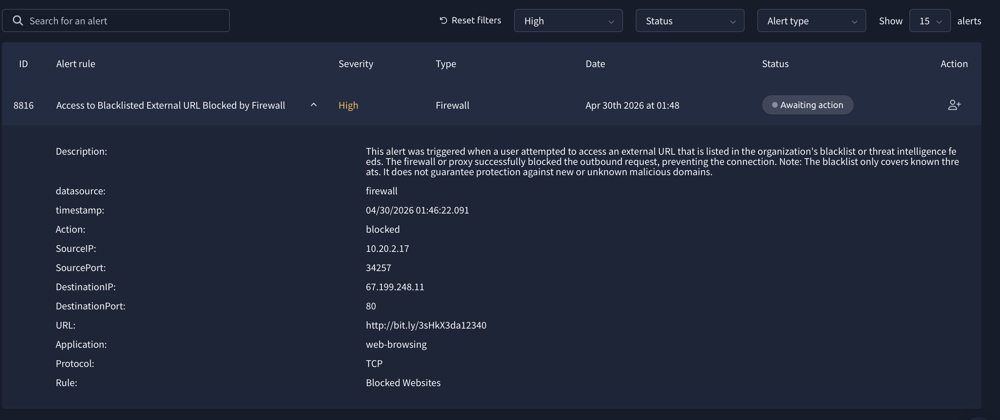
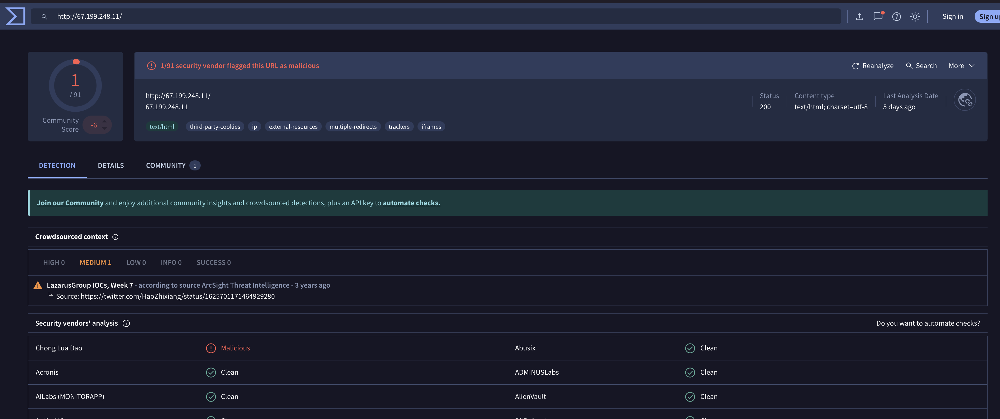
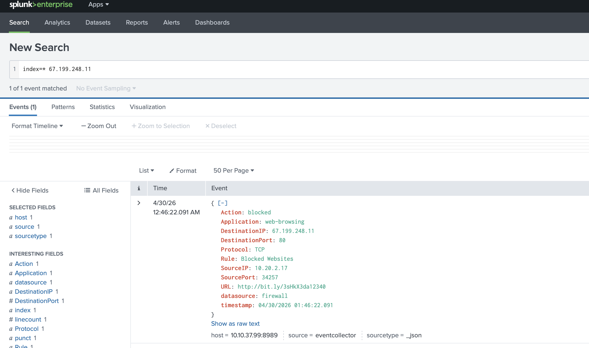

# Incident 1: Malicious URL Access Blocked

**Date**: April 30, 2026  
**Severity**: High  
**Status**: Resolved  
**Alert ID**: 8816

## What Happened

On April 30, 2026, at 01:46:22 UTC, a user from an internal computer attempted to access a suspicious URL. The URL was on our blocklist and was flagged as malicious. The firewall blocked this connection before any damage could occur.

### Key Details

| Field | Value |
|-------|-------|
| **Internal IP** | 10.20.2.17 |
| **Destination IP** | 67.199.248.11 |
| **URL Accessed** | http://bit.ly/3sHKX3da12340 |
| **Destination Port** | 80 (HTTP) |
| **Source Port** | 34257 |
| **Protocol** | TCP |
| **Action** | Blocked by Firewall |

## Investigation Steps

### 1. Alert Detection
The security system generated a high-severity alert when the user tried to access a blacklisted external URL. The alert was triggered by the firewall's "Blocked Websites" rule.

### 2. Dashboard Overview
The incident appeared in the SOC dashboard along with other active alerts. This incident was marked as one of the phishing-related alerts.

### 3. URL Reputation Check
We looked up the destination URL on VirusTotal to confirm it was malicious. The check showed:

- **Community Score**: 1/91 security vendors flagged it as malicious
- **Status**: Malicious
- **Related Activity**: Identified as part of LazarusGroup IOCs (Lazarus Group is known for targeted attacks)
- **Detection Details**: Multiple security features detected (trackers, redirects, third-party cookies)

### 4. Log Analysis in Splunk
We searched Splunk for all connections involving the destination IP (67.199.248.11) to determine if there were any other attempts or successful connections.

- **Result**: 1 event found
- **Finding**: The single event matched our firewall alert, confirming the block was successful
- **No successful connections to this IP were found**

## What the Tools Showed

### Firewall (Alert View)
- Alert Rule: "Access to Blacklisted External URL Blocked by Firewall"
- The firewall is working as intended - it's blocking known malicious destinations
- The timestamp (04/30/2026 01:46:22.091) shows exactly when the attempt was made

### VirusTotal (URL Reputation)
- The URL bit.ly/3sHKX3da12340 redirects to 67.199.248.11
- This IP hosts content that's been identified as malicious
- 1 out of 91 security vendors flagged it (this means it's a known malicious domain)

### Splunk (Log Verification)
- Confirms the firewall log entry
- Shows the complete network connection details
- No evidence of a successful breach or alternate paths to the destination

## Root Cause

The user clicked on a malicious link, likely from an email or website. The link was probably part of a phishing campaign targeting our organization. Fortunately, our firewall rules prevented any connection.

## Actions Taken

1. ✅ **Alert Classified**: Marked as successfully blocked (True Positive)
2. ✅ **URL Verified**: Confirmed malicious via VirusTotal
3. ✅ **Logs Reviewed**: Checked for any other connection attempts
4. ✅ **No Further Action Needed**: No data was compromised since the firewall blocked the connection

## Lessons

- **Defense in Depth Works**: The firewall rule, blocklist, and monitoring system all worked together
- **Quick Response**: The alert was generated and investigated immediately
- **Verification is Important**: Checking VirusTotal confirmed the threat was real
- **User Education Needed**: The user still tried to access the link, so security awareness training may help

## Resolution

This incident is resolved. The connection was blocked, no data was compromised, and the attempt has been logged for future reference and compliance records.

---

**Investigation Completed By**: SOC Lab  
**Date Resolved**: April 30, 2026
