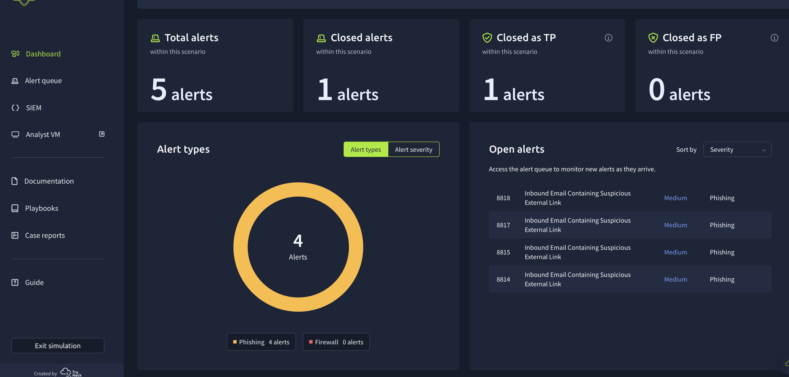

# SOC Lab - Security Incident Investigations

This repository contains SOC incident analysis and investigation notes, including findings, screenshots, and final reports.

## SOC Analysis Directories

- [Incident-1](./Incident-1/) - Full investigation for a malicious URL access attempt
- [Incident-1/analysis](./Incident-1/analysis/) - Analysis artifacts for Incident-1
- [Incident-1/screenshots](./Incident-1/screenshots/) - Evidence screenshots used in the report

## Dashboard

---

*Last updated: April 2026*
